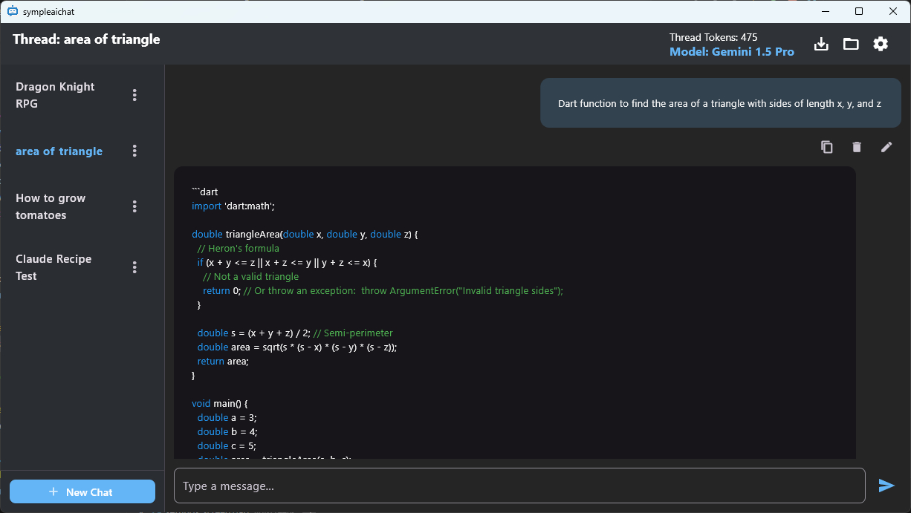
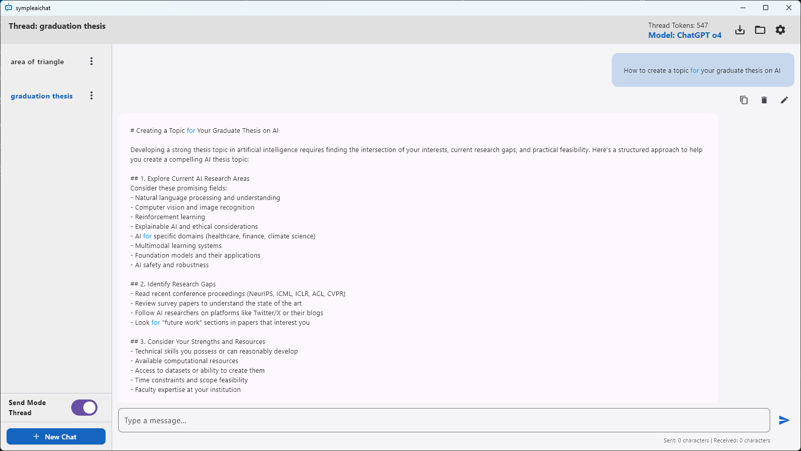

# SimpleAIChat

A fast, ad-free, fully local AI chat client for Windows.  
Designed for Claude, ChatGPT, Gemini — with full message editing and local history.

---

## ✨ Features

- 🧠 **Claude-ready**: Works with Claude 3.5 Haiku / 3.7 Sonnet, ChatGPT, Gemini
- 📝 **Edit and delete messages** freely in any conversation
- 💾 **Everything is saved locally** — no data sent to third-party servers
- 🔐 **API keys are never uploaded** (saved on your device only)
- 🖥️ **Windows-native .exe app** — no Electron, no browser dependency
- 🧵 **Multi-threaded chat interface** (thread switcher & history)
- 🌙 Clean, minimal UI with dark mode
- 📦 Lightweight build — launches instantly

---

## 📸 Screenshots

  

---

## 🛠️ Installation

1. Download the latest `.exe` from the [Releases](https://github.com/your-username/SimpleAIChat/releases) page.
2. Run `SimpleAIChat.exe`.
3. Set your API key in the settings (`config.ini` or in-app).

---

## 🚀 Getting Started

1. Launch the app
2. Enter your API key for Claude / ChatGPT / Gemini
3. Start chatting, editing, and exploring — all saved locally

---

## ⚠️ Important Notes

- Messages you **edit** are stored only on your device.
- If you re-send an edited message to an API provider (e.g., OpenAI or Anthropic), you are responsible for that content.
- Always follow each provider’s usage policies. Abuse may result in account suspension.

---

## 📄 License

MIT License — see [LICENSE](LICENSE).

---

## 🔍 Disclaimer

This is an **independent, unofficial client**.  
It is **not affiliated with OpenAI, Google, or Anthropic**.  
All API keys are stored locally and never shared.  
Use is subject to each provider’s terms of service.

---

SimpleAIChat is built for those who want full control over their AI chat experience —  
without ads, without tracking, and without compromises.
