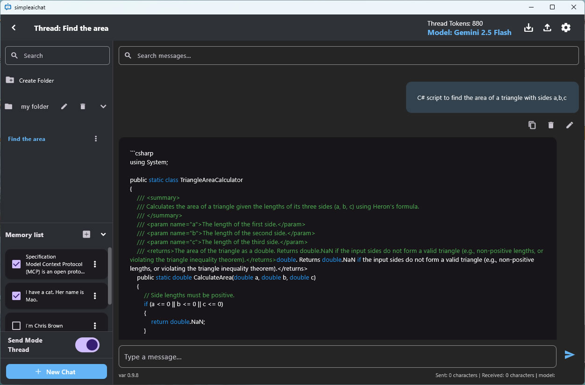
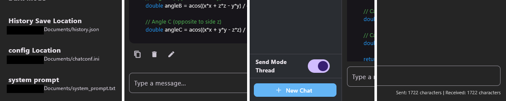

  

# SimpleAIChat
[Repositories](https://github.com/sympleaichat/simpleaichat)

A fast, ad-free, fully local AI chat client for Windows.  

Designed for Claude, ChatGPT, Gemini, Grok, DeepSeek, Mistral — with full message editing and local history.

🔔[news] Support for Grok4 API!🔔

Download for Desktop 
([Windows](https://github.com/sympleaichat/simpleaichat/raw/refs/heads/main/SimpleAIChatSetup.exe)) 

---
## Why SimpleAIChat?

Most LLMs today — whether GPT, Claude, Grok, Gemini, DeepSeek, Mistral — are accessed through hosted web interfaces that abstract away the details of message formatting, memory control, and backend behavior.

That’s convenient — but not always ideal.

**SimpleAIChat** is a lightweight, local-first chat client for people who want more control, transparency, or minimalism in how they interact with large language models. It supports multiple backends and aims to provide a clean, editable space to experiment, prototype, or just talk to your favorite models on your own terms.

## Design Philosophy

- LLM is treated as a stateless engine by default, with all memory and personalization stored and editable on the PC.
- Minimize UI friction: no login, no telemetry, no branding — just your models and your prompts.
- Make it easy to extend, customize, and connect to other tools.

## Roadmap / Ideas

- External memory (e.g. user profiles, emotional context, long-term preferences)
- Prompt scaffolding and message structuring tools
- Message history visualization and editing

## Contributing / Feedback

This project started as a personal tool to get closer to how LLMs really behave — without the UI layers getting in the way.

If you’ve ever wished for a simpler, more direct way to interact with your preferred models, give it a try.  
Pull requests and ideas are welcome!

##  Features

 Works with Claude, ChatGPT, Gemini, Grok, DeepSeek, Mistral
 Edit and delete messages freely in any conversation  
 Everything is saved locally — no data sent to third-party servers  
 API keys are never uploaded (saved on your device only)  
 Windows-native .exe app — no Electron, no browser dependency  
 Multi-threaded chat interface (thread switcher & history)  
 Clean, minimal UI with dark mode  
 Lightweight build — launches instantly  
 Custom system prompt support via external file  
 Full chat history is sent with each request for better context understanding  

---

###  There are many helpful features for chatting with LLMs
Configuration information such as API keys, message history, and system prompts can be stored locally and edited.  
Messages can be sent in either thread mode or single message mode.  
Messages can be deleted or edited individually.  
The character count of messages at the time of sending can be checked.  
 

By using the memory function, the information registered by the user will be added when sending a request. The data to be sent can be specified using the checkboxes.

##  Installation

1. Download the latest `.exe` from the [Releases](https://github.com/your-username/SimpleAIChat/releases) page.
2. Run `SimpleAIChat.exe`.
3. Set your API key in the settings (`chatconf.ini` or in-app).

---

##  Getting Started

1. Launch the app
2. Enter your API key for Claude / ChatGPT / Gemini / Grok / DeepSeek / Mistral
3. Start chatting, editing, and exploring — all saved locally

---

##  Important Notes

- Messages you **edit** are stored only on your device.
- If you re-send an edited message to an API provider (e.g., OpenAI or Anthropic), you are responsible for that content.
- Always follow each provider’s usage policies. Abuse may result in account suspension.

---

##  License

MIT License — see [LICENSE](LICENSE).

---

##  Disclaimer

This is an **independent, unofficial client**.  
It is **not affiliated with OpenAI, Google, Anthropic, Grok, deepseek,  Mistral **.  
All API keys are stored locally and never shared.  
Use is subject to each provider’s terms of service.

##  Link
anthropic https://www.anthropic.com/api

OpenAI https://openai.com/api/

gemini https://ai.google.dev/gemini-api/docs

Grok https://x.ai/api

deepseek https://api-docs.deepseek.com/

Mistral https://docs.mistral.ai/api/

bestaitoolfinder https://bestaitoolfinder.com/

---

SimpleAIChat is built for those who want full control over their AI chat experience —  
without ads, without tracking, and without compromises.
