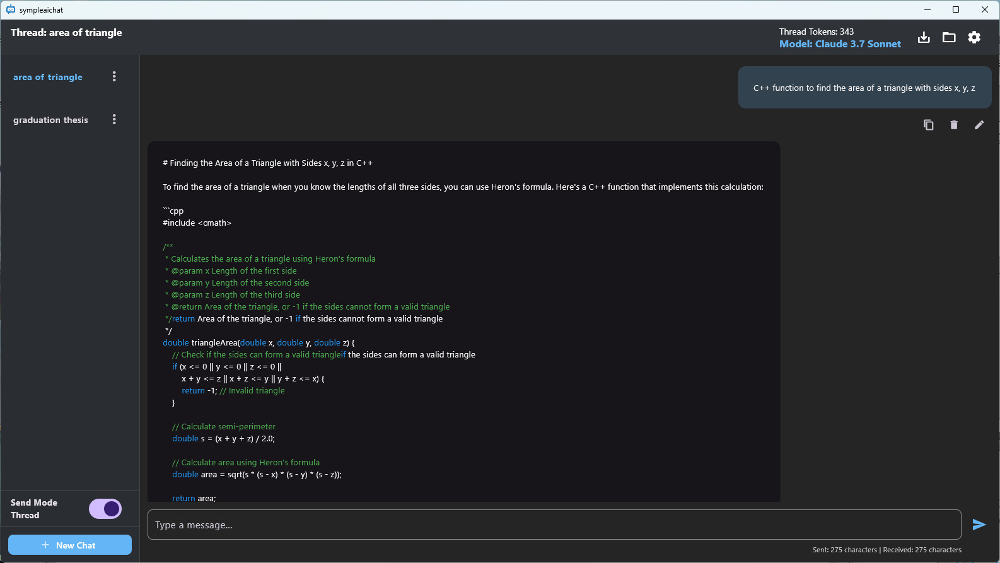

# SimpleAIChat

SimpleAIChat is a lightweight, secure, and fully local AI chat client built with Flutter.

It connects to OpenAI and Gemini and Claude APIs, allowing you to have flexible and private conversations without relying on external servers.  
All your conversation history and API keys are safely stored on your device.

---

## Features

- 📦 Lightweight and fast startup
- 🔒 Fully local storage (no server-side data saving)
- 🛡️ API keys managed and saved locally
- 🧠 Supports the following models\
  ChatGPT o4-mini\
  ChatGPT o4\
  ChatGPT 3.5-turbo\
  Gemini 1.5 Pro\
  Claude 3.5 Haiku\
  Claude 3.7 Sonnet
- 💬 Multi-threaded conversation management (coming soon)
- 🌙 Simple and clean user interface
- 🗑️Deleting messages in a thread
- 📝Edit message content
  
---

## Screenshots

---

## Installation

1. Download the latest release from the [Releases](https://github.com/your-username/SimpleAIChat/releases) page.
2. Extract the zip file.
3. Run `SimpleAIChat.exe` (for Windows) or build from source for other platforms.

---

## Usage

1. Enter your API key in the settings.
2. Start chatting!
3. All conversations are stored securely on your device.

---

## Notice

This application allows local editing of conversation content. Please be aware that any modified messages sent to API services (such as OpenAI or Anthropic) are your sole responsibility.
Abuse or violation of the API provider’s terms may result in service suspension or account ban.
Use responsibly.

---

## License

This project is licensed under the [MIT License](LICENSE).

---

## Disclaimer

SimpleAIChat is an independent, unofficial client.  
It is not affiliated with or endorsed by OpenAI or Google.
All API keys are used locally and are never transmitted to any third-party servers.\
The app provides an interface to third-party AI services (OpenAI, Gemini, etc.). Use is subject to the terms and conditions of each respective provider.\
The developer is not responsible for any charges, API fees, or data loss that may result from the use of the app.
